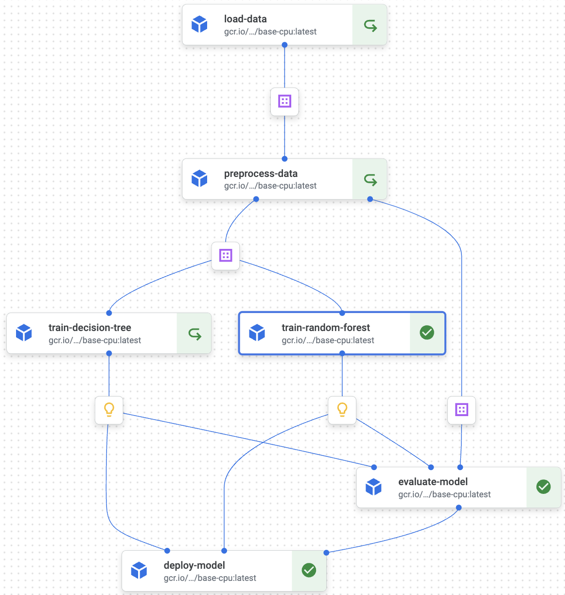

   # MLPlatform: Machine Learning Pipeline on GCP
   `MLPlatform` is a robust machine learning pipeline designed to streamline ML workflows on Google Cloud Platform (GCP) resources. Following best practices in MLOps and DevOps, it offers a structured and efficient approach to managing data loading, preprocessing, model training, evaluation, and deployment.

   ## Pipeline Visualization

   Below is a visualization of the MLPlatform pipeline components as executed on Vertex AI:

   

   The diagram illustrates the sequential and parallel processing of tasks within the pipeline:

   - `load-data`: Fetches and loads data into the pipeline.
   - `preprocess-data`: Processes the loaded data, preparing it for training.
   - `train-decision-tree` and `train-random-frost`: Train two separate models in parallel.
   - `evaluate-model`: Evaluates both models and selects the best performing one.
   - `deploy-model`: Deploys the chosen model to a Vertex AI endpoint for serving.

   Each component runs in a containerized environment, ensuring isolation and scalability.
   ## Project Structure

   ```graphql
   mlplatform_project/
   │
   ├── components/               # Pipeline components (data load, preprocess, train, etc.)
   │   ├── load_data.py
   │   ├── preprocess_data.py
   │   ├── train_decision_tree.py
   │   ├── train_random_forest.py
   │   ├── evaluate_model.py
   │   └── deploy_model.py
   │
   ├── config/                   # Configuration files and settings
   │   ├── __init__.py
   │   └── config.py
   │
   ├── notebooks/                # Jupyter notebooks for demonstrations and experiments
   │   └── mlplatform.ipynb
   │
   ├── tests/                    # Test scripts for pipeline components
   │   └── test_mlpipeline.py
   │
   ├── mlpipeline.py             # Main pipeline script
   ├── pyproject.toml            # Project dependencies and configurations
   ├── poetry.lock               # Poetry lock file for dependencies management
   ├── Makefile                  # Makefile for easy execution of tasks
   └── README.md                 # Project overview and documentation
   ```
   ## Installation

   1. Clone the Repository:

      Clone the `mlplatform` repository to your local machine.

   ```bash
   git clone git@github.com:kbakande/MLOPS.git
   cd mlplatform_project
   ```

   2. Install Python:

      Ensure you have Python >= 3.9 installed. You can download it from [python.org](https://www.python.org/).

   3. Install Dependencies:

      Use [Poetry](https://python-poetry.org/) for managing Python dependencies:

      ```bash
      poetry install
      ```

   ## Usage
      The project includes a Makefile for easy execution of tasks:

   * Run the ML Pipeline:

   ```bash
   make run_pipeline
   ```

   * Run Tests:

   ```bash
   make run_tests
   ```

   * Clean Temporary Files:

   ```bash
   make clean
   ```

   * Display Help Information:

   ```bash
   make help
   ```

   ## Continuous Integration and Deployment with GitHub Actions

   This project leverages GitHub Actions for automated Continuous Integration (CI) and Continuous Deployment (CD) to Vertex AI. The configured workflow automates the process of testing, building, and deploying the ML pipeline, ensuring a streamlined and error-free deployment process.

   ### Workflow Overview

   The `.github/workflows/main.yml` file defines the GitHub Actions workflow with the following key steps:

   1. **Checkout Code**: Checks out the repository code, making it available for the workflow.

   2. **Authenticate with Google Cloud**: Uses `google-github-actions/auth` action to authenticate with Google Cloud using the provided service account key. This step is crucial for allowing subsequent steps to interact with Google Cloud services.

   3. **Set up Cloud SDK**: Sets up the Google Cloud SDK, preparing the environment for interactions with Google Cloud services.

   4. **Use gcloud CLI**: Demonstrates the successful setup of the Cloud SDK by running `gcloud info`.

   5. **Install Dependencies**: Installs project dependencies managed by Poetry, ensuring all required Python packages are available.

   6. **Compile and Deploy Pipeline to Vertex AI**: Runs the `mlpipeline.py` script, which compiles the Kubeflow pipeline to JSON and deploys it to Vertex AI. This step is critical for automating the deployment of the machine learning pipeline to the cloud.

   ### Triggering the Workflow

   The workflow is configured to trigger on two events:

   - **Push to Main Branch**: Automatically starts the workflow whenever changes are pushed to the `main` branch.
   - **Manual Dispatch**: Allows for manual triggering of the workflow from the GitHub repository's Actions tab, providing flexibility for on-demand deployments.

   ### Security and Configuration

   Sensitive information, such as service account keys and project IDs, are securely stored in GitHub Secrets and accessed as environment variables within the workflow. This approach ensures security best practices by keeping sensitive data out of the codebase.

   ## Dependencies

      Key Python libraries and frameworks used in this project:

   * Pandas
   * NumPy
   * Scikit-learn
   * XGBoost
   * LightGBM
   * Google Cloud AI Platform
   * Pytest for testing
   * Kubeflow Pipelines (KFP)

   ## Author
   [Kabeer Akande](https://www.linkedin.com/in/koakande/)
